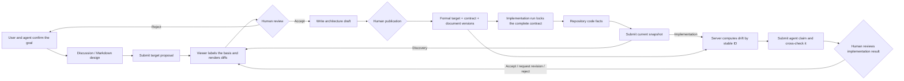

# AI Architecture Viewer

[简体中文](README.md)

[](https://github.com/Accsy7/ai-architecture-viewer/actions/workflows/ci.yml)

[](LICENSE)

> **License:** Source code is available only for the noncommercial purposes defined by the [PolyForm Noncommercial License 1.0.0](LICENSE). Derivative versions must retain the attribution in [NOTICE](NOTICE) and follow the [Project Name and Brand Usage Policy](TRADEMARKS.en.md).

AI Architecture Viewer is a local-first architecture collaboration surface between coding agents and people. For a concept project, a user and an agent such as Codex or Claude Code can form a target architecture from confirmed discussion conclusions or Markdown design material. For a code project, the agent can use its existing repository tools to submit current snapshots and implementation reports. The viewer renders these results as verifiable diagrams, basis records, and diffs; the user decides what to accept, revise, and publish.

It does not embed a model, require a model API key, or scan a repository on an agent's behalf.


All bundled screens and data are fictional. No customer, production, or personal data is included.

## What the v0.5.0 MVP does

- Lets external agents read published stable IDs, responsibilities, relationships, and boundaries as a compact semantic graph without retransmitting layout data.
- Supports concept projects without a code repository by accepting target proposals from user-confirmed discussion or Markdown design material.
- Creates a traceable run for each discovery, planning, or reconciliation task. An implementation run locks the published target graph, revision, development contract, and bound-document hashes—never a draft.
- Distinguishes four visible basis types: user confirmation, design document, code fact, and agent inference.
- Verifies file-based paths, line ranges, and content hashes; rejects escaped, sensitive, or stale material.
- Allows discussion and design material to support target design, but never as proof of current implementation.
- Freezes a versioned development contract when a target is published: source proposal, target semantic hash, stable acceptance-criterion IDs, involved nodes and relationships, permission boundaries, and bound-document hashes travel with the formal revision. Runtime checks recompute the graph, target index, and boundary index, so editing JSON outside publication invalidates the contract. Older revisions do not receive invented criteria; they are explicitly `legacy-unbound` and non-executable.
- Requires implementation reports to reference every frozen criterion ID exactly once; omitted, extra, or rewritten criteria are rejected.
- Joins each formal criterion statement and target reference with the report status and evidence in a separate server-computed contract gate. Architecture alignment is not enough: `partial / blocked`, unsatisfied, unverified, or legacy runs without a contract gate can only request revision or be rejected.
- Preserves generic `interactionModes` (human UI and/or system service) and `architectureLayer` values through proposals, compact reads, and implementation drift checks.
- Converts agent architecture snapshots into semantic diffs. Existing nodes omitted from a snapshot are never removed automatically.
- Requires an implementation run to submit a complete `code-fact`-backed resulting snapshot before a report that references both that snapshot and the formal-target lock.
- Computes `missing / extra / changed / unverified` drift on the server by stable ID, including responsibilities, authorization boundaries, relationship endpoints and types, and controlled boundary posture instead of trusting agent self-report alone.
- Separates the agent claim, automatic architecture gate, formal-contract gate, and human review into four independent states. An agent claiming `complete` does not complete the project, and both automatic gates must pass before acceptance is available.
- Cross-checks every server result against the implementation report. Unexplained, unreported, or unverified drift blocks human acceptance, while an agent-provided explanation is always labeled as awaiting human judgment.
- Requires every implementation report to be accepted, rejected, or sent back for revision in the local UI. The reviewer, time, decision, and note are recorded without rewriting the formal target.
- Returns a low-context agent claim, architecture-gate summary, and human-review state from `get_review_status` by default, loading per-item target, actual, evidence, and explanation detail only when requested.
- Places architecture proposals in a human inbox with per-change evidence and submitter provenance.
- Reserves acceptance and rejection for the user. Acceptance writes only a draft; publication requires a second explicit human action.
- Keeps current architecture, target architecture, diffs, drafts, and immutable revision history.
- Bundles three portable skills for a consistent understand–plan–verify handoff.

## Workflow



The capability boundary is explicit: the MCP server exposes no `approve` or `publish` tool. Agents investigate, reason, and submit; people decide and publish.

“Explained drift” only means the agent's explanation maps to a server-computed drift item. It does not prove the explanation is reasonable, record user acceptance, or change the architecture target. Even when the automatic gate finds no architecture drift, the user must still validate the page and product experience. Making the code the new target still requires a target proposal, draft acceptance, and explicit human publication.

| Basis type | Meaning | Proves current implementation? |
| --- | --- | --- |
| User confirmation | A target or boundary explicitly confirmed by the user | No |
| Design document | Intended design described by Markdown or similar material | No |
| Code fact | Implementation directly verified from repository files | Yes |
| Agent inference | A conclusion not yet confirmed by the user or code | No |

## Quick start

Requires [Node.js](https://nodejs.org/) 20 or later.

```powershell
npm install
npm start
```

Open `http://127.0.0.1:8800`. To use a different port:

```powershell
$env:PORT = '8891'
npm start
```

The MCP server can be started separately. It starts the local viewer automatically when necessary:

```powershell
npm run mcp
```

### Connect Codex

Configure the local STDIO server in `.codex/config.toml` for a trusted project. Replace the paths with absolute paths on your machine:

```toml
[mcp_servers.ai_architecture_viewer]
command = "node"
args = ["D:/path/to/ai-architecture-viewer/mcp-server.mjs"]
cwd = "D:/path/to/ai-architecture-viewer"

[mcp_servers.ai_architecture_viewer.env]
VIEWER_PROJECT_DIR = "D:/architecture-data/my-project"
VIEWER_WORKSPACE_ROOT = "D:/work/my-project"
```

The Codex desktop app, CLI, and IDE extension share MCP configuration. See the [official Codex MCP documentation](https://developers.openai.com/codex/mcp/).

### Connect Claude Code

Configure the server in the project's `.mcp.json`:

```json
{
  "mcpServers": {
    "ai-architecture-viewer": {
      "command": "node",
      "args": ["D:/path/to/ai-architecture-viewer/mcp-server.mjs"],
      "cwd": "D:/path/to/ai-architecture-viewer",
      "env": {
        "VIEWER_PROJECT_DIR": "D:/architecture-data/my-project",
        "VIEWER_WORKSPACE_ROOT": "${CLAUDE_PROJECT_DIR:-.}"
      }
    }
  }
}
```

The client asks you to trust a new local MCP server on first use. See the [official Claude Code MCP documentation](https://code.claude.com/docs/en/mcp).

## MCP tools

| Tool | Purpose | Changes formal architecture? |
| --- | --- | --- |
| `get_project_context` | Read project, diagrams, formal-baseline status, contract invalidation reason, and collaboration boundaries | No |
| `read_project_document` | Read bounded Markdown by registered `documentId` and optional heading | No |
| `get_current_architecture` | Read the current published architecture as a compact semantic graph | No |
| `create_agent_run` | Create a traceable run; implementation runs lock the target, development contract, and document hashes | No |
| `submit_architecture_snapshot` | Submit current-state understanding and evidence | No; creates candidate diffs only |
| `submit_change_proposal` | Submit a target architecture change | No; enters the inbox only |
| `submit_implementation_report` | Submit the agent's implementation claim, checks, and drift | No; it cannot replace human review |
| `get_review_status` | Read agent claim, architecture/contract-gate summaries, and human-review state; request drift or criterion details only when needed | No |
| `get_approved_target` | Read the latest human-published target, execution status, compact graph, and frozen contract | No |

Accepting a proposal only applies its changes to the target draft; it does not authorize an agent to implement that draft. `get_review_status` marks this state as `awaiting-publication`. `get_approved_target` switches to the new revision and frozen contract only after explicit human publication. Legacy or manual targets without acceptance criteria are honestly non-executable, and unpublished drafts are never returned as executable target graphs.

## CLI and file fallback

Agents without MCP support can produce the JSON artifacts defined under [`protocol/`](protocol/) and submit them with the local CLI:

```powershell
npm run agent -- context

npm run agent -- create-run `
  --agent Codex `
  --client codex `
  --task architecture-discovery

npm run agent -- submit `
  --run run-id-from-previous-command `
  --artifact ai-coding/discovery/run-id/architecture-snapshot.json `
  --evidence ai-coding/discovery/run-id/evidence-manifest.json
```

Validate one exchange artifact with:

```powershell
npm run protocol:validate -- ai-coding/path/to/artifact.json
```

## Collaboration skills

[`skills/`](skills/) contains three vendor-neutral workflows:

- `architecture-discovery`: inspect a user-authorized repository scope and submit a current architecture snapshot with evidence.
- `architecture-change-plan`: form options, target changes, and acceptance criteria from confirmed discussion, design documents, or code facts; concept projects require no code repository.
- `implementation-reconcile`: compare actual code with the run-locked published formal target, submit the resulting snapshot first, then submit checks, the agent's completion claim, and all drift; the user still decides the final outcome.

Skills prefer MCP and fall back to JSON files plus the CLI. They cannot accept their own proposals, alter published architecture, or approve implementation for the user.

## Project data package

The viewer, its project data package, and the inspected code repository can all live in separate directories. A package normally contains:

- `project.json`: instance inventory and default-project marker.
- `viewer.config.json`: titles, views, and detail fields.
- `architecture-catalog.json`: diagram catalog and hierarchy.
- `state.json` and `diagrams/`: semantic architecture, drafts, and revision history.
- `viewer-layout.json`: presentation-only local layout.
- `document-registry.json` and `documents/`: citable project material.
- `analysis.json`: agent runs, exchange artifacts, evidence, automatic architecture/contract gates, and human-review state.

Load a package from outside this repository and bind evidence verification to the actual code workspace:

```powershell
$env:VIEWER_PROJECT_DIR = 'D:\work\my-architecture-package'
$env:VIEWER_WORKSPACE_ROOT = 'D:\work\my-code-repository'
npm start
```

Code-fact paths are always relative to `VIEWER_WORKSPACE_ROOT`; the viewer rereads those files and verifies their hashes. Project design documents use a separate bounded route: an agent can read only Markdown registered in `document-registry.json`, by `documentId` and optional heading, under `VIEWER_PROJECT_DIR`. It cannot submit an arbitrary disk path, and registered documents can support target design but never current implementation. Discussion records retain a source label, confirmation time, and review excerpt. This keeps an architecture package and its code repository safely separate without opening an arbitrary multi-root scanner. When the workspace setting is omitted, it defaults to `VIEWER_PROJECT_DIR`.

## Development and verification

```powershell
npm test
npm run build
```

See [CONTRIBUTING.md](CONTRIBUTING.md) for development conventions, [SECURITY.md](SECURITY.md) for security reporting, [CODE_OF_CONDUCT.md](CODE_OF_CONDUCT.md) for community standards, and [CHANGELOG.md](CHANGELOG.md) for release history.

## Public-release and security boundaries

- Default examples and documents must be fictional or explicitly authorized for public release.
- Never commit credentials, access tokens, customer material, internal paths, or architecture data that has not been de-identified.
- Agents may submit structured candidates and implementation claims only. Implementation review, proposal acceptance, and architecture publication require human actions.
- v0.5.0 binds to `127.0.0.1` only. Mutation APIs do not yet provide authentication, CSRF protection, or multi-user authorization; do not proxy the service to a LAN or the public internet.
- Source code uses the [PolyForm Noncommercial License 1.0.0](LICENSE). It is source-available, not OSI open source. Commercial use requires separate written authorization; see [COMMERCIAL_LICENSE.en.md](COMMERCIAL_LICENSE.en.md).
- Derivative works are allowed, but public modified versions must retain [NOTICE](NOTICE) attribution and follow [TRADEMARKS.en.md](TRADEMARKS.en.md): use a different name and logo and do not imply official status or endorsement.
- Third-party dependencies remain subject to their own licenses.
