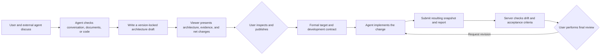

# AI Architecture Viewer

[简体中文](README.md)

[](https://github.com/Accsy7/ai-architecture-viewer/actions/workflows/ci.yml)

[](LICENSE)

> **License:** Source code is available only for the noncommercial purposes defined by the [PolyForm Noncommercial License 1.0.0](LICENSE). Derivative versions must retain the attribution in [NOTICE](NOTICE) and follow the [Project Name and Brand Usage Policy](TRADEMARKS.en.md).

**Turn a coding agent's understanding of a project into architecture diagrams you can inspect.**

AI Architecture Viewer is a local-first workspace for architecture collaboration between people and coding agents — turning project understanding into structured, inspectable architecture.

You discuss goals with external agents such as Codex or Claude Code. After analyzing the conversation, design documents, or code, the agent writes structured results to a version-locked draft. The viewer presents current and target architecture, evidence, documents, and implementation drift — and only you can publish the formal version or accept the final result.

## Try the synthetic demo first

The repository includes a fully fictional **Synthetic Support Assistant**. It demonstrates the viewer without customer, production, or personal data.

Install [Node.js](https://nodejs.org/) 20 or later, then run:

```powershell
npm install
npm start
```

Open `http://127.0.0.1:8800`. A suggested walkthrough:

1. Switch between Current architecture and Target architecture to see what exists versus what is planned.
2. Select any module to focus its one-hop relationships — unrelated modules and edges fade back.
3. Enter the Retrieval service drill-down to see the same product at a different architecture level.
4. Inspect bound documents, the draft's net changes against the formal version, and the full pre-publication review.
5. Use `English` / "中文" to switch the viewer shell. Project names, module names, relationship descriptions, documents, and user-authored text stay unchanged.

To use another port:

```powershell
$env:PORT = '8891'
npm start
```

## Problems it solves

| Common problem | How the viewer responds |
| --- | --- |
| What you describe and what the agent understands don't match | The agent writes a visual draft that exposes modules, relationships, responsibilities, and boundaries for direct inspection |
| Every new task requires the project to be explained again | Formal architecture uses stable IDs and a compact semantic graph, so agents read only the context they need |
| Current implementation, target design, and future ideas become mixed | Current, target, draft, and formal versions remain separate, with immutable history |
| An agent quietly shifts the target to match its implementation | Agents can change drafts only; a local user alone can publish a formal version |
| Missing, extra, or changed work is found only after development | The server compares actual implementation with the formal target by stable ID and sends drift to human review |
| Large diagrams make relationships hard to follow | Selecting a module focuses one-hop relationships; projects may also register read-only business flows and drill-down diagrams |

## Four states

| State | What it means | Who can change it |
| --- | --- | --- |
| Current architecture | The actual structure supported by code facts or other explicit evidence | An agent may write a current draft; a user publishes the formal version |
| Target architecture | The product and system structure the user wants to reach | An agent may write a target draft; a user publishes the formal version |
| Draft | Unpublished net change against the formal version | An agent may update it incrementally under an exact version lock |
| Formal version | The stable baseline used for future development and reconciliation | Only a local user may publish or restore it |

Publishing a target freezes a versioned development contract — acceptance criteria, target modules and relationships, permission boundaries, and bound documents are all captured. An unpublished draft is never returned by `get_approved_target` and cannot serve as the baseline for an implementation run.

## Human-agent collaboration loop



The loop has only two true human decisions:

- publishing formal architecture;
- accepting, rejecting, or requesting revision of an implementation result.

An agent reporting `complete` means only "the agent claims completion." It does not complete the project. Even when automatic checks pass, a human must still validate the real interface and business path.

## Current core capabilities

### 1. Make project understanding inspectable

- Supports code repositories as well as concept projects that have only discussion or Markdown design material.
- Models modules, relationships, responsibilities, product state, technical state, and authorization boundaries with stable IDs.
- Distinguishes four evidence types: user confirmation, design document, code fact, and agent inference.
- File evidence is verified against relative paths, line ranges, and content hashes; sensitive, escaped, or stale evidence is rejected.
- Discussion and design material may inform the target design but can never serve as current implementation facts.

### 2. Make complex architecture easier to read

- Group regions represent capability or product domains. Card positions and region geometry are stored separately and do not affect architecture semantics.
- Selecting a module focuses its one-hop relationships and fades unrelated content.
- Supports drill-down between a product overview and internal architecture.
- Projects can register read-only business flows and walk through them step by step using explicit node and relationship mappings.
- The inspector prioritizes what a module does, how far it has progressed, what it cannot do, and its related documents; governance details expand on demand.

### 3. Let agents update drafts safely

- Agent writes require both a published baseline lock and the exact active-draft revision.
- Concurrent edits, stale baselines, no-op patches, invalid relationship endpoints, and forbidden fields fail atomically.
- Agents may update supported semantic fields only. They cannot write canvas positions, edge routing, human confirmation, or publication state.
- The canvas shows the draft's net difference from the formal version rather than accumulating every historical operation.
- Legacy proposals and review records remain readable history but are never auto-accepted or fabricated into a new draft.

### 4. Publish an executable formal target

- Pre-publication review displays every module, relationship, permission boundary, acceptance criterion, and bound-document change.
- Target publication freezes a development contract and document hashes; a document changed after review blocks the publication.
- Older targets without a complete contract are explicitly marked `legacy-unbound` or non-executable rather than receiving fabricated criteria.
- MCP exposes no publication, approval, or implementation-review tools, so an agent cannot bypass the human gate.

### 5. Reconcile implementation with the target

- Implementation runs lock a published formal target only; they never read a target draft as their baseline.
- The agent must submit a complete resulting snapshot backed by `code-fact` evidence before the implementation report.
- The server computes `missing / extra / changed / unverified` by stable ID and compares responsibilities, authorization boundaries, relationship endpoints and types, and controlled-boundary posture.
- Implementation reports must reference every formal-contract criterion exactly. Missing, extra, or rewritten criteria are rejected.
- Explained drift means only that the agent supplied a matching explanation. It does not make the explanation acceptable, change the target, or imply user acceptance.

## What it does not do or require

- Does not embed or purchase additional model capability.
- Does not replace Codex, Claude Code, or another agent for reading, searching, or modifying code.
- Does not make the viewer a second chat product.
- Does not let an agent publish formal architecture, accept implementation results, or fabricate user confirmation.
- Does not treat layout movement as a semantic architecture change.
- Does not present inference, discussion, or design documents as implemented code facts.

## How to connect an agent

The MCP service can run independently. If the viewer is not running, it starts the local server automatically:

```powershell
npm run mcp
```

### Codex

Configure the local STDIO server in a trusted project's `.codex/config.toml`, replacing the sample paths with absolute local paths:

```toml
[mcp_servers.ai_architecture_viewer]
command = "node"
args = ["D:/path/to/ai-architecture-viewer/mcp-server.mjs"]
cwd = "D:/path/to/ai-architecture-viewer"

[mcp_servers.ai_architecture_viewer.env]
VIEWER_PROJECT_DIR = "D:/architecture-data/my-project"
VIEWER_WORKSPACE_ROOT = "D:/work/my-project"
```

Codex desktop, CLI, and IDE extensions share the MCP configuration. See the [official Codex MCP documentation](https://developers.openai.com/codex/mcp/).

### Claude Code

Configure the project `.mcp.json`:

```json
{
  "mcpServers": {
    "ai-architecture-viewer": {
      "command": "node",
      "args": ["D:/path/to/ai-architecture-viewer/mcp-server.mjs"],
      "cwd": "D:/path/to/ai-architecture-viewer",
      "env": {
        "VIEWER_PROJECT_DIR": "D:/architecture-data/my-project",
        "VIEWER_WORKSPACE_ROOT": "${CLAUDE_PROJECT_DIR:-.}"
      }
    }
  }
}
```

The client asks you to trust the local MCP service on first use. See the [official Claude Code MCP documentation](https://code.claude.com/docs/en/mcp).

## MCP tools

These tools are available for agents to call. All of them only read or write drafts; none can modify the formal version.

| Tool | Purpose | Can it change formal architecture? |
| --- | --- | --- |
| `get_project_context` | Read the project, formal baselines, and collaboration boundaries | No |
| `read_project_document` | Read a bounded Markdown section by registered `documentId` | No |
| `get_current_architecture` | Read the published current architecture as a compact semantic graph | No |
| `create_agent_run` | Create a traceable run and lock the required baselines | No |
| `submit_architecture_snapshot` | Write a locked current draft during discovery, or submit reconciliation evidence during implementation | No |
| `submit_change_proposal` | Write a stable-ID semantic patch to the locked target draft | No |
| `submit_implementation_report` | Submit the agent's implementation claim, checks, and drift explanations | No |
| `get_review_status` | Read publication waiting state, automatic gates, and human-review state | No |
| `get_approved_target` | Read the latest user-published target and frozen contract | No |

## Project data package

The viewer, architecture package, and inspected code repository can each live in a different directory. A package normally includes:

- `project.json`: project-instance inventory;
- `viewer.config.json`: bilingual shell, views, and detail fields;
- `architecture-catalog.json`: diagram catalog and hierarchy;
- `state.json` and `diagrams/`: semantic architecture, drafts, and revision history;
- `viewer-layout.json`: presentation-only local layout;
- `registered-business-flows.json`: optional read-only business-flow registry;
- `document-registry.json` and `documents/`: citable project material;
- `analysis.json`: agent runs, evidence, automatic gates, and human-review records.

To load a package from outside the repository and bind code-evidence verification to the actual workspace:

```powershell
$env:VIEWER_PROJECT_DIR = 'D:\work\my-architecture-package'
$env:VIEWER_WORKSPACE_ROOT = 'D:\work\my-code-repository'
npm start
```

Code-evidence file paths are always relative to `VIEWER_WORKSPACE_ROOT`. Registered design documents live under `VIEWER_PROJECT_DIR` and can be read only by document ID and an optional Markdown heading. They cannot serve as evidence that current code already implements something.

## CLI and collaboration skills

Agents without MCP support can also generate the JSON artifacts defined under [`protocol/`](protocol/) and submit them through the local CLI:

```powershell
npm run agent -- context

npm run agent -- create-run `
  --agent Codex `
  --client codex `
  --task architecture-discovery

npm run agent -- submit `
  --run run-id-from-previous-command `
  --artifact ai-coding/discovery/run-id/architecture-snapshot.json `
  --evidence ai-coding/discovery/run-id/evidence-manifest.json
```

[`skills/`](skills/) includes three vendor-neutral workflows:

- `architecture-discovery`: understand current architecture and submit code evidence;
- `architecture-change-plan`: form a target draft and acceptance criteria from discussion, design documents, or code facts;
- `implementation-reconcile`: compare actual implementation with the formal target while leaving the final decision to the user.

## Development and verification

```powershell
npm test
npm run build
```

See [CONTRIBUTING.md](CONTRIBUTING.md) for development conventions, [SECURITY.md](SECURITY.md) for security reporting, [CODE_OF_CONDUCT.md](CODE_OF_CONDUCT.md) for community standards, and [CHANGELOG.md](CHANGELOG.md) for release history.

## Security and licensing boundaries

- v0.6.1 listens on `127.0.0.1` only. Mutation APIs do not yet provide authentication, CSRF protection, or multi-user authorization; do not proxy the service to a LAN or the public internet.
- Project source code uses the [PolyForm Noncommercial License 1.0.0](LICENSE). It is source-available, not OSI open source.
- Commercial use requires separate written authorization; see [COMMERCIAL_LICENSE.en.md](COMMERCIAL_LICENSE.en.md).
- Public modified versions must retain [NOTICE](NOTICE) attribution and follow [TRADEMARKS.en.md](TRADEMARKS.en.md): use a different project name and logo and do not imply official status or endorsement.
- Third-party dependencies remain subject to their own licenses.
