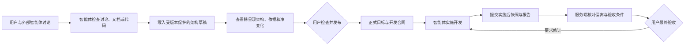

# AI 架构查看器

[English](README.en.md)

[](https://github.com/Accsy7/ai-architecture-viewer/actions/workflows/ci.yml)

[](LICENSE)

> **许可说明：** 本项目源码仅针对 [PolyForm Noncommercial License 1.0.0](LICENSE) 定义的非商业用途开放。二次开发必须保留 [NOTICE](NOTICE) 中的署名，并遵守 [项目名称与标识使用政策](TRADEMARKS.md)。

**把编码智能体对项目的理解，变成用户可视化的架构图。**

AI Architecture Viewer 是一个本地优先的架构协作工具——让人和 AI 编码智能体一起，把对项目的理解变成结构化、可查验的架构。

你和智能体在 Codex、Claude Code 等工具中讨论目标；智能体分析讨论内容、设计文档或代码后，将结构化结果写入受版本保护的草稿。查看器负责呈现：当前架构、目标架构、依据、文档和实施偏离。只有你可以发布正式版本，并最终验收实施结果。

## 先体验虚构 Demo

仓库自带一个完全虚构的 **Synthetic Support Assistant**。它用于演示查看器能力，不包含客户、生产或个人数据。

需要 [Node.js](https://nodejs.org/) 20 或更高版本：

```powershell
npm install
npm start
```

打开 `http://127.0.0.1:8800`。建议按以下顺序体验：

1. 在“当前架构”和“目标架构”之间切换，理解“已实现”和“待实现”的区别。
2. 点击任意模块，查看它的一跳关系——无关模块和连线会暂时弱化。
3. 从 Retrieval service 进入下钻架构，看同一产品在不同层级下的结构。
4. 查看模块绑定的文档、草稿相对正式版的净变化，以及发布前的完整检查内容。
5. 点击 `English` / “中文”切换界面语言。项目名称、模块名称、关系描述、文档和用户原文保持原样。

使用其他端口：

```powershell
$env:PORT = '8891'
npm start
```

## 它解决什么问题

| 常见问题 | 查看器的处理方式 |
| --- | --- |
| 你描述的架构和 AI 理解的不一样 | AI 把理解写成可视化草稿，你直接检查模块、关系、职责和边界 |
| 每次换任务都要重新解释整个项目 | 正式架构使用稳定 ID 和精简语义结构，智能体只读取需要的上下文 |
| 目标架构、当前实现和未来设想混在一起 | 当前、目标、草稿、正式版本相互独立，并保留不可变历史 |
| AI 为了迎合代码而悄悄改目标 | AI 只能修改草稿；正式版本只能由本地用户发布 |
| 开发完成后才发现做少、做多或做偏 | 服务端按稳定 ID 核对实际实现与正式目标，并把偏离交给用户验收 |
| 大图中的关系难以阅读 | 点击模块自动进入一跳关系聚焦；项目还可以登记只读业务链路和下钻架构 |

## 四个状态

| 状态 | 表示什么 | 谁可以改变 |
| --- | --- | --- |
| 当前架构 | 代码事实或明确依据支持的现有结构 | AI 写入草稿；用户发布正式版 |
| 目标架构 | 你希望项目达到的产品与系统结构 | AI 写入草稿；用户发布正式版 |
| 草稿 | 相对正式版尚未发布的净变化 | AI 可在精确版本锁下增量修改 |
| 正式版本 | 后续开发和核验使用的稳定基线 | 只有本地用户可以发布或恢复 |

目标架构发布后会冻结为版本化开发合同——包括验收条件、目标模块与关系、权限边界及绑定文档。未发布的草稿永远不会被 `get_approved_target` 返回，也不能作为实施运行的基线。

## 人机协作闭环



这个闭环只保留两个真正的人工决定：

- 你发布正式架构；
- 你接受、拒绝或要求修订实施结果。

智能体的 `complete` 只表示“智能体声称完成”，不等于项目已经完成。即使自动核对通过，仍然需要你沿真实页面和业务路径做最终验收。

## 当前核心能力

### 1. 把项目理解变成可查验的架构

- 支持有代码仓库的项目，也支持只有讨论和 Markdown 设计资料的概念项目。
- 用稳定 ID 描述模块、关系、职责、产品状态、技术状态和权限边界。
- 区分四类依据：用户确认、设计文档、代码事实和智能体推断。
- 文件依据会校验相对路径、行号和内容哈希；敏感路径、越界路径和过期证据会被拒绝。
- 讨论和设计资料只能用于目标设计，不能当作当前已实现的代码事实。

### 2. 让复杂架构图更容易阅读

- 用分组区域表达能力域或产品域；卡片位置和区域尺寸可单独保存，不改变架构语义。
- 点击模块自动聚焦其一跳关系，无关内容弱化。
- 支持模块下钻，在产品总览和内部架构之间切换。
- 项目可登记只读业务链路，按明确的节点和关系映射逐步查看。
- 右侧详情优先展示：模块做什么、当前做到哪一步、不能做什么和相关文档，治理细节按需展开。

### 3. 让 AI 安全地修改草稿

- 智能体需同时锁定已发布基线和活动草稿修订号，才能提交语义补丁。
- 并发修改、过期基线、无效果补丁、非法关系端点或不允许的字段会被原子拒绝。
- AI 只能修改受支持的语义字段，不能写入画布位置、连线路由、人工确认或正式发布状态。
- 画布显示草稿相对正式版的净变化，而非堆积每次历史操作。
- 旧版提案和审阅记录保持只读可查，不会被自动接受或伪造成新草稿。

### 4. 发布可执行的正式目标

- 发布前展示全部模块、关系、权限边界、验收条件和绑定文档的变化。
- 目标发布时冻结开发合同和文档哈希；文档在检查后发生变化会阻止发布。
- 旧目标如果没有完整合同，会明确标为 `legacy-unbound` 或不可执行，而非补造验收条件。
- MCP 未提供发布、审批或实施验收工具，智能体无法绕过人工审批。

### 5. 核对实施是否偏离目标

- 实施运行只锁定已发布的正式目标，不读取目标草稿。
- 智能体必须先提交由 `code-fact` 支持的完整实施后快照，再提交实施报告。
- 服务端按稳定 ID 计算 `missing / extra / changed / unverified`，并核对职责、授权边界、关系端点、关系类型和受控边界。
- 实施报告必须逐项引用正式合同中的验收条件；漏报、增报或改写都会被拒绝。
- 已解释的偏离只表示智能体给出了说明，不意味着说明合理、目标已改变或已被用户接受。

## 不会/不需要

- 内嵌或购买额外的大模型能力。
- 代替 Codex、Claude Code 等智能体读取、搜索或修改代码。
- 把查看器做成第二个聊天产品。
- AI 发布正式架构、接受实施结果或伪造用户确认。
- 把布局拖动当成架构语义变化。
- 把推断、讨论或设计文档伪装成已经实现的代码事实。

## 如何连接智能体？

MCP 服务可单独启动；如果查看器尚未运行，它会自动在本地启动：

```powershell
npm run mcp
```

### Codex

在受信任项目的 `.codex/config.toml` 中配置本地 STDIO 服务，并把示例路径替换为本机绝对路径：

```toml
[mcp_servers.ai_architecture_viewer]
command = "node"
args = ["D:/path/to/ai-architecture-viewer/mcp-server.mjs"]
cwd = "D:/path/to/ai-architecture-viewer"

[mcp_servers.ai_architecture_viewer.env]
VIEWER_PROJECT_DIR = "D:/architecture-data/my-project"
VIEWER_WORKSPACE_ROOT = "D:/work/my-project"
```

Codex 桌面应用、CLI 和 IDE 扩展共享 MCP 配置。参阅 [Codex MCP 官方说明](https://developers.openai.com/codex/mcp/)。

### Claude Code

在项目 `.mcp.json` 中配置：

```json
{
  "mcpServers": {
    "ai-architecture-viewer": {
      "command": "node",
      "args": ["D:/path/to/ai-architecture-viewer/mcp-server.mjs"],
      "cwd": "D:/path/to/ai-architecture-viewer",
      "env": {
        "VIEWER_PROJECT_DIR": "D:/architecture-data/my-project",
        "VIEWER_WORKSPACE_ROOT": "${CLAUDE_PROJECT_DIR:-.}"
      }
    }
  }
}
```

首次连接时，客户端会要求确认是否信任该本地 MCP 服务。参阅 [Claude Code MCP 官方说明](https://code.claude.com/docs/en/mcp)。

## MCP 工具一览

以下工具供智能体调用。所有工具均只能读写草稿，不能修改正式版本。

| 工具 | 用途 | 能否改变正式架构 |
| --- | --- | --- |
| `get_project_context` | 读取项目、正式基线和协作边界 | 否 |
| `read_project_document` | 按登记的 `documentId` 读取受限 Markdown 片段 | 否 |
| `get_current_architecture` | 读取已发布当前架构的精简语义图 | 否 |
| `create_agent_run` | 创建可追溯运行并锁定所需基线 | 否 |
| `submit_architecture_snapshot` | 发现时写入锁定当前草稿；实施时提交核验快照 | 否 |
| `submit_change_proposal` | 写入锁定目标草稿的稳定 ID 语义补丁 | 否 |
| `submit_implementation_report` | 提交智能体实施声明、检查和偏离说明 | 否 |
| `get_review_status` | 读取草稿等待发布、自动门禁和人工验收状态 | 否 |
| `get_approved_target` | 读取最近一次由用户发布的目标与冻结合同 | 否 |

## 项目数据包

查看器、架构数据包和被检查的代码仓库可以分开放置在三个不同目录中。一个数据包通常包含以下文件：

- `project.json`：项目实例清单；
- `viewer.config.json`：双语外壳、视图和详情字段；
- `architecture-catalog.json`：架构图目录与层级导航；
- `state.json`、`diagrams/`：语义架构、草稿和版本历史；
- `viewer-layout.json`：仅用于呈现的本地布局；
- `registered-business-flows.json`：可选的只读业务链路登记；
- `document-registry.json`、`documents/`：可引用的项目资料；
- `analysis.json`：智能体运行、证据、自动门禁和人工验收记录。

从仓库外加载数据包，并将代码证据核验绑定到实际工作区：

```powershell
$env:VIEWER_PROJECT_DIR = 'D:\work\my-architecture-package'
$env:VIEWER_WORKSPACE_ROOT = 'D:\work\my-code-repository'
npm start
```

代码证据中的文件路径始终相对于 `VIEWER_WORKSPACE_ROOT`。登记的设计文档位于 `VIEWER_PROJECT_DIR`，只能通过文档 ID 和可选 Markdown 标题读取，不能用作“当前代码已实现”的证据。

## 命令行与协作 Skill

不支持 MCP 的智能体也可以生成 [`protocol/`](protocol/) 定义的 JSON 工件，通过本地命令行提交：

```powershell
npm run agent -- context

npm run agent -- create-run `
  --agent Codex `
  --client codex `
  --task architecture-discovery

npm run agent -- submit `
  --run run-id-from-previous-command `
  --artifact ai-coding/discovery/run-id/architecture-snapshot.json `
  --evidence ai-coding/discovery/run-id/evidence-manifest.json
```

[`skills/`](skills/) 提供三套供应商中立流程：

- `architecture-discovery`：理解当前架构并提交代码证据；
- `architecture-change-plan`：从讨论、设计文档或代码事实形成目标草稿和验收条件；
- `implementation-reconcile`：对照正式目标核验实际实现，最终结论仍由用户决定。

## 开发与验证

```powershell
npm test
npm run build
```

开发规范见 [CONTRIBUTING.md](CONTRIBUTING.md)，安全报告见 [SECURITY.md](SECURITY.md)，社区标准见 [CODE_OF_CONDUCT.md](CODE_OF_CONDUCT.md)，版本变化见 [CHANGELOG.md](CHANGELOG.md)。

## 安全与许可边界

- v0.6.1 只监听 `127.0.0.1`。变更接口尚无身份验证、CSRF 防护或多用户授权，请勿反向代理到局域网或互联网。
- 项目源码采用 [PolyForm Noncommercial License 1.0.0](LICENSE)，属于 source-available，而非 OSI 开源许可。
- 商业使用需要另行获得书面授权，见 [COMMERCIAL_LICENSE.md](COMMERCIAL_LICENSE.md)。
- 公开发布修改版本时必须保留 [NOTICE](NOTICE) 署名，并遵守 [TRADEMARKS.md](TRADEMARKS.md)：使用不同的项目名称和 Logo，不得暗示获得官方背书。
- 第三方依赖仍受其各自许可证约束。
