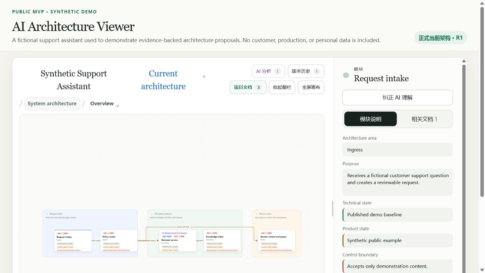
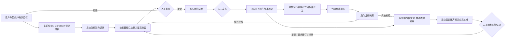

# AI 架构查看器

[English](README.en.md)

[](https://github.com/Accsy7/ai-architecture-viewer/actions/workflows/ci.yml)

[](LICENSE)

> **许可说明：** 本项目源码仅针对 [PolyForm Noncommercial License 1.0.0](LICENSE) 定义的非商业用途开放。二次开发必须保留 [NOTICE](NOTICE) 中的署名，并遵守 [项目名称与标识使用政策](TRADEMARKS.md)。

AI 架构查看器是一个本地优先的“编码智能体 ↔ 用户”架构协作界面。概念项目可以先由用户与 Codex、Claude Code 等智能体通过讨论或 Markdown 设计材料形成目标架构；代码项目可以由智能体使用已有的仓库工具提交当前架构快照和实施报告。查看器把这些结果呈现为可核验的图、依据和差异，并由用户决定是否接受、修订和发布。

它不内嵌大模型，不需要模型 API Key，也不会替智能体自动扫描整个代码仓库。



仓库内置的所有画面和数据均为虚构 Demo，不包含客户、生产或个人数据。

## v0.4.0 MVP 能做什么

- 让外部智能体以精简语义结构读取已发布架构、稳定 ID、职责、关系和边界，无需重复传输布局数据。
- 支持无代码仓库的概念项目：从用户确认的讨论结论或 Markdown 设计材料提交目标架构提案。
- 为每次项目理解、架构规划或实施核验创建独立运行记录；实施运行会额外锁定当时已发布目标的图 ID、版本、版本 ID 和语义哈希，绝不绑定草案。
- 区分“用户确认、设计文档、代码事实、智能体推断”四类依据，并在审阅界面逐条显示。
- 对文件依据校验相对路径、行号和内容哈希，拒绝越界、敏感或已经变化的内容。
- 讨论和设计材料只能支持目标设计，不能被提交为当前已经实现的事实。
- 将智能体的架构快照自动转换为语义差异；快照没有提到的现有节点不会被自动删除。
- 要求实施运行先提交由 `code-fact` 支持的完整实施后快照，再提交引用该快照和正式目标锁的实施报告。
- 由服务端按稳定 ID 自动核对 `missing / extra / changed / unverified`，覆盖模块职责、权限边界、关系端点、关系类型和受控边界姿态，而不是只相信智能体自报。
- 将智能体声明、自动架构门禁和人工验收拆成三个独立状态：智能体声称 `complete` 不代表项目完成，自动核对通过也只能进入“可供人工验收”。
- 将服务端结果与智能体报告逐条交叉核对；未说明、未报告或未核验的偏离会阻止人工接受，智能体提供的解释始终标为“待人工判断”。
- 所有实施报告都必须由用户在本地界面接受、拒绝或要求修订；结论记录验收人、时间和备注，但不会改写正式目标。
- `get_review_status` 默认只返回低成本的智能体声明、架构门禁摘要和人工验收状态，需要时才读取逐项偏离、目标项、实际项、证据和解释。
- 将架构提案放入人工收件箱，逐项显示变更、证据和提交来源。
- 只有用户可以接受或拒绝提案；接受只会写入草案，发布仍需再次人工确认。
- 保存当前架构、目标架构、差异、草案和不可变版本历史。
- 通过三套可移植 Skill 统一“理解项目—规划变更—核验实施”的交接格式。

## 工作方式



权限边界很明确：MCP 服务器没有 `approve` 或 `publish` 工具。智能体负责调查、推理和提交；用户负责决策和发布。

实施核验中的“已解释偏离”只表示智能体的说明与服务端计算出的偏离条目能够对应，不表示说明合理、用户已经接受或架构目标已经改变。即使自动架构核对未发现偏离，页面和业务体验仍需用户实际验收。若代码需要成为新目标，仍必须重新提交目标提案并经过“接受草案 → 人工发布”。

| 依据类型 | 含义 | 可证明当前已实现 |
| --- | --- | --- |
| 用户确认 | 用户明确确认的目标或边界 | 否 |
| 设计文档 | Markdown 等材料描述的目标设计 | 否 |
| 代码事实 | 从仓库文件直接核验的实现事实 | 是 |
| 智能体推断 | 尚未被用户或代码证实的判断 | 否 |

## 快速开始

需要 [Node.js](https://nodejs.org/) 20 或更高版本。

```powershell
npm install
npm start
```

浏览器打开 `http://127.0.0.1:8800`。使用其他端口：

```powershell
$env:PORT = '8891'
npm start
```

MCP 服务可单独启动；如果查看器尚未运行，它会自动在本地启动：

```powershell
npm run mcp
```

### 连接 Codex

在受信任项目的 `.codex/config.toml` 中配置本地 STDIO 服务。请把路径替换为本机绝对路径：

```toml
[mcp_servers.ai_architecture_viewer]
command = "node"
args = ["D:/path/to/ai-architecture-viewer/mcp-server.mjs"]
cwd = "D:/path/to/ai-architecture-viewer"

[mcp_servers.ai_architecture_viewer.env]
VIEWER_PROJECT_DIR = "D:/architecture-data/my-project"
VIEWER_WORKSPACE_ROOT = "D:/work/my-project"
```

Codex 桌面应用、CLI 和 IDE 扩展共享 MCP 配置。参阅 [Codex MCP 官方说明](https://developers.openai.com/codex/mcp/)。

### 连接 Claude Code

在项目 `.mcp.json` 中配置：

```json
{
  "mcpServers": {
    "ai-architecture-viewer": {
      "command": "node",
      "args": ["D:/path/to/ai-architecture-viewer/mcp-server.mjs"],
      "cwd": "D:/path/to/ai-architecture-viewer",
      "env": {
        "VIEWER_PROJECT_DIR": "D:/architecture-data/my-project",
        "VIEWER_WORKSPACE_ROOT": "${CLAUDE_PROJECT_DIR:-.}"
      }
    }
  }
}
```

首次使用时，客户端会要求你确认是否信任该本地 MCP 服务。参阅 [Claude Code MCP 官方说明](https://code.claude.com/docs/en/mcp)。

## MCP 工具

| 工具 | 用途 | 是否改变正式架构 |
| --- | --- | --- |
| `get_project_context` | 读取项目、图谱、基线和协作边界 | 否 |
| `get_current_architecture` | 以精简语义图读取当前已发布架构 | 否 |
| `create_agent_run` | 创建可追溯运行；实施运行锁定正式目标版本和语义哈希 | 否 |
| `submit_architecture_snapshot` | 提交当前架构理解和证据 | 否，只生成候选差异 |
| `submit_change_proposal` | 提交目标架构变更 | 否，只进入收件箱 |
| `submit_implementation_report` | 提交智能体对实施结果的声明、测试和偏离 | 否，不能代替人工验收 |
| `get_review_status` | 查询智能体声明、架构门禁摘要和人工验收状态，按需读取逐项偏离详情 | 否 |
| `get_approved_target` | 以精简语义图读取最近一次由用户发布的正式目标基线 | 否 |

接受提案只会把变更写入目标草案，并不授权智能体据此开发。`get_review_status` 会把这种状态标为 `awaiting-publication`；只有用户再次明确发布后，`get_approved_target` 才会返回新版本。未发布草案不会作为可执行目标图输出。

## 命令行与文件后备入口

不能使用 MCP 的智能体仍可生成 [`protocol/`](protocol/) 定义的 JSON 工件，并通过本地命令行提交：

```powershell
npm run agent -- context

npm run agent -- create-run `
  --agent Codex `
  --client codex `
  --task architecture-discovery

npm run agent -- submit `
  --run run-id-from-previous-command `
  --artifact ai-coding/discovery/run-id/architecture-snapshot.json `
  --evidence ai-coding/discovery/run-id/evidence-manifest.json
```

校验单个交换工件：

```powershell
npm run protocol:validate -- ai-coding/path/to/artifact.json
```

## 协作 Skill

[`skills/`](skills/) 内置三套供应商中立流程：

- `architecture-discovery`：在用户授权范围内检查仓库，提交当前架构快照和证据清单。
- `architecture-change-plan`：从用户确认的讨论、设计文档或代码事实形成备选方案、目标架构差异和验收标准；概念项目无需代码仓库。
- `implementation-reconcile`：把实际代码与运行锁定的已发布正式目标对照，先提交实施后快照，再提交测试、智能体完成声明和全部偏离；最终结论仍由用户验收。

Skill 优先使用 MCP；不可用时回退到 JSON 文件和命令行。它们不能接受自己的提案、修改已发布架构或代表用户批准实施。

## 项目数据包

查看器、项目数据包与待检查代码仓库可以三者分离。数据包通常包含：

- `project.json`：实例清单和默认项目标记。
- `viewer.config.json`：界面标题、视图和详情字段。
- `architecture-catalog.json`：架构图目录和层级导航。
- `state.json`、`diagrams/`：语义架构、草案和版本历史。
- `viewer-layout.json`：仅用于呈现的本地布局。
- `document-registry.json`、`documents/`：可引用的项目资料。
- `analysis.json`：智能体运行、交换工件、证据、自动架构门禁和人工验收记录。

从仓库外加载自己的项目数据包，并将证据校验明确绑定到实际代码仓库：

```powershell
$env:VIEWER_PROJECT_DIR = 'D:\work\my-architecture-package'
$env:VIEWER_WORKSPACE_ROOT = 'D:\work\my-code-repository'
npm start
```

智能体提交的文件依据路径都相对于 `VIEWER_WORKSPACE_ROOT`；查看器会在该目录内重新读取文件并核对内容哈希。讨论依据没有虚构的文件路径，而是保存来源标签、确认时间和供用户审阅的摘录。概念项目可以只提供设计资料，不要求代码仓库；代码项目的“当前架构”和“实施结果”则必须由代码事实支持。未设置工作区时，它默认与 `VIEWER_PROJECT_DIR` 相同。真实项目数据应保存在此公共仓库之外或私有工作区中。

## 开发与验证

```powershell
npm test
npm run build
```

开发规范见 [CONTRIBUTING.md](CONTRIBUTING.md)，安全报告见 [SECURITY.md](SECURITY.md)，社区标准见 [CODE_OF_CONDUCT.md](CODE_OF_CONDUCT.md)，版本变化见 [CHANGELOG.md](CHANGELOG.md)。

## 公开发布与安全边界

- 默认示例和文档必须为虚构内容或已获准公开发布。
- 不得提交密钥、访问令牌、客户材料、内部路径或未经脱敏的架构数据。
- 智能体只能提交结构化候选和实施声明；实施验收、提案接受和架构发布均需人工操作。
- v0.4.0 仅监听 `127.0.0.1`，变更 API 尚无身份验证、CSRF 防护或多用户授权。不要将其反向代理到局域网或互联网。
- 源码采用 [PolyForm Noncommercial License 1.0.0](LICENSE)，属于 source-available 而非 OSI 开源许可。商业使用需另行书面授权，见 [COMMERCIAL_LICENSE.md](COMMERCIAL_LICENSE.md)。
- 允许衍生作品，但公开发布的修改版本必须保留 [NOTICE](NOTICE) 署名，并遵守 [TRADEMARKS.md](TRADEMARKS.md)：使用不同项目名称和 Logo，不得暗示为官方版本或获得原作者背书。
- 第三方依赖仍受其自身许可证约束。
