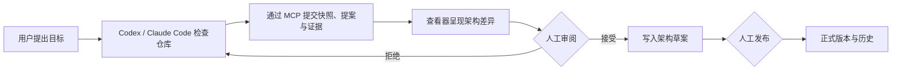

# AI 架构查看器

[English](README.en.md)

[](https://github.com/Accsy7/ai-architecture-viewer/actions/workflows/ci.yml)

[](LICENSE)

> **许可说明：** 本项目源码仅针对 [PolyForm Noncommercial License 1.0.0](LICENSE) 定义的非商业用途开放。二次开发必须保留 [NOTICE](NOTICE) 中的署名，并遵守 [项目名称与标识使用政策](TRADEMARKS.md)。

AI 架构查看器是一个本地优先的“编码智能体 ↔ 用户”架构协作界面。Codex、Claude Code 等智能体使用自己已有的仓库工具理解代码，再通过标准 MCP 或 JSON 文件协议提交架构快照、变更提案和实施报告；查看器负责把这些结果呈现为可核验的图、证据和差异，并由用户决定是否接受、修订和发布。

它不内嵌大模型，不需要模型 API Key，也不会替智能体自动扫描整个代码仓库。


仓库内置的所有画面和数据均为虚构 Demo，不包含客户、生产或个人数据。

## v0.2.0 MVP 能做什么

- 让外部智能体读取当前已发布架构、图谱目录和项目文档索引。
- 为每次项目理解、架构规划或实施核验创建独立运行记录，并锁定提交时的架构基线。
- 接收带文件路径、行号和内容哈希的证据清单，拒绝越界、敏感或已经变化的证据。
- 将智能体的架构快照自动转换为语义差异；快照没有提到的现有节点不会被自动删除。
- 将架构提案放入人工收件箱，逐项显示变更、证据和提交来源。
- 只有用户可以接受或拒绝提案；接受只会写入草案，发布仍需再次人工确认。
- 保存当前架构、目标架构、差异、草案和不可变版本历史。
- 通过三套可移植 Skill 统一“理解项目—规划变更—核验实施”的交接格式。

## 工作方式



权限边界很明确：MCP 服务器没有 `approve` 或 `publish` 工具。智能体负责调查、推理和提交；用户负责决策和发布。

## 快速开始

需要 [Node.js](https://nodejs.org/) 20 或更高版本。

```powershell
npm install
npm start
```

浏览器打开 `http://127.0.0.1:8800`。使用其他端口：

```powershell
$env:PORT = '8891'
npm start
```

MCP 服务可单独启动；如果查看器尚未运行，它会自动在本地启动：

```powershell
npm run mcp
```

### 连接 Codex

在受信任项目的 `.codex/config.toml` 中配置本地 STDIO 服务。请把路径替换为本机绝对路径：

```toml
[mcp_servers.ai_architecture_viewer]
command = "node"
args = ["D:/path/to/ai-architecture-viewer/mcp-server.mjs"]
cwd = "D:/path/to/ai-architecture-viewer"

[mcp_servers.ai_architecture_viewer.env]
VIEWER_PROJECT_DIR = "D:/architecture-data/my-project"
VIEWER_WORKSPACE_ROOT = "D:/work/my-project"
```

Codex 桌面应用、CLI 和 IDE 扩展共享 MCP 配置。参阅 [Codex MCP 官方说明](https://developers.openai.com/codex/mcp/)。

### 连接 Claude Code

在项目 `.mcp.json` 中配置：

```json
{
  "mcpServers": {
    "ai-architecture-viewer": {
      "command": "node",
      "args": ["D:/path/to/ai-architecture-viewer/mcp-server.mjs"],
      "cwd": "D:/path/to/ai-architecture-viewer",
      "env": {
        "VIEWER_PROJECT_DIR": "D:/architecture-data/my-project",
        "VIEWER_WORKSPACE_ROOT": "${CLAUDE_PROJECT_DIR:-.}"
      }
    }
  }
}
```

首次使用时，客户端会要求你确认是否信任该本地 MCP 服务。参阅 [Claude Code MCP 官方说明](https://code.claude.com/docs/en/mcp)。

## MCP 工具

| 工具 | 用途 | 是否改变正式架构 |
| --- | --- | --- |
| `get_project_context` | 读取项目、图谱、基线和协作边界 | 否 |
| `get_current_architecture` | 读取当前已发布架构 | 否 |
| `create_agent_run` | 创建可追溯运行并锁定基线 | 否 |
| `submit_architecture_snapshot` | 提交当前架构理解和证据 | 否，只生成候选差异 |
| `submit_change_proposal` | 提交目标架构变更 | 否，只进入收件箱 |
| `submit_implementation_report` | 提交实施结果、测试和偏离 | 否 |
| `get_review_status` | 查询人工审阅结果 | 否 |
| `get_approved_target` | 读取人工已接受的目标草案或正式目标 | 否 |

## 命令行与文件后备入口

不能使用 MCP 的智能体仍可生成 [`protocol/`](protocol/) 定义的 JSON 工件，并通过本地命令行提交：

```powershell
npm run agent -- context

npm run agent -- create-run `
  --agent Codex `
  --client codex `
  --task architecture-discovery

npm run agent -- submit `
  --run run-id-from-previous-command `
  --artifact ai-coding/discovery/run-id/architecture-snapshot.json `
  --evidence ai-coding/discovery/run-id/evidence-manifest.json
```

校验单个交换工件：

```powershell
npm run protocol:validate -- ai-coding/path/to/artifact.json
```

## 协作 Skill

[`skills/`](skills/) 内置三套供应商中立流程：

- `architecture-discovery`：在用户授权范围内检查仓库，提交当前架构快照和证据清单。
- `architecture-change-plan`：把用户目标转化为备选方案、推荐方案、目标架构差异和验收标准。
- `implementation-reconcile`：把实际代码与人工批准的架构对照，提交测试结果、完成度和全部偏离。

Skill 优先使用 MCP；不可用时回退到 JSON 文件和命令行。它们不能接受自己的提案、修改已发布架构或代表用户批准实施。

## 项目数据包

查看器、项目数据包与待检查代码仓库可以三者分离。数据包通常包含：

- `project.json`：实例清单和默认项目标记。
- `viewer.config.json`：界面标题、视图和详情字段。
- `architecture-catalog.json`：架构图目录和层级导航。
- `state.json`、`diagrams/`：语义架构、草案和版本历史。
- `viewer-layout.json`：仅用于呈现的本地布局。
- `document-registry.json`、`documents/`：可引用的项目资料。
- `analysis.json`：智能体运行、交换工件、证据和提案审阅记录。

从仓库外加载自己的项目数据包，并将证据校验明确绑定到实际代码仓库：

```powershell
$env:VIEWER_PROJECT_DIR = 'D:\work\my-architecture-package'
$env:VIEWER_WORKSPACE_ROOT = 'D:\work\my-code-repository'
npm start
```

智能体提交的所有证据路径都相对于 `VIEWER_WORKSPACE_ROOT`；查看器会在该目录内重新读取文件并核对内容哈希。未设置时，它默认与 `VIEWER_PROJECT_DIR` 相同，兼容把数据包直接放在代码仓库根目录的简单用法。真实项目数据应保存在此公共仓库之外或私有工作区中。

## 开发与验证

```powershell
npm test
npm run build
```

开发规范见 [CONTRIBUTING.md](CONTRIBUTING.md)，安全报告见 [SECURITY.md](SECURITY.md)，社区标准见 [CODE_OF_CONDUCT.md](CODE_OF_CONDUCT.md)，版本变化见 [CHANGELOG.md](CHANGELOG.md)。

## 公开发布与安全边界

- 默认示例和文档必须为虚构内容或已获准公开发布。
- 不得提交密钥、访问令牌、客户材料、内部路径或未经脱敏的架构数据。
- 智能体只能提交结构化候选；接受和发布均需人工操作。
- v0.2.0 仅监听 `127.0.0.1`，变更 API 尚无身份验证、CSRF 防护或多用户授权。不要将其反向代理到局域网或互联网。
- 源码采用 [PolyForm Noncommercial License 1.0.0](LICENSE)，属于 source-available 而非 OSI 开源许可。商业使用需另行书面授权，见 [COMMERCIAL_LICENSE.md](COMMERCIAL_LICENSE.md)。
- 允许衍生作品，但公开发布的修改版本必须保留 [NOTICE](NOTICE) 署名，并遵守 [TRADEMARKS.md](TRADEMARKS.md)：使用不同项目名称和 Logo，不得暗示为官方版本或获得原作者背书。
- 第三方依赖仍受其自身许可证约束。
