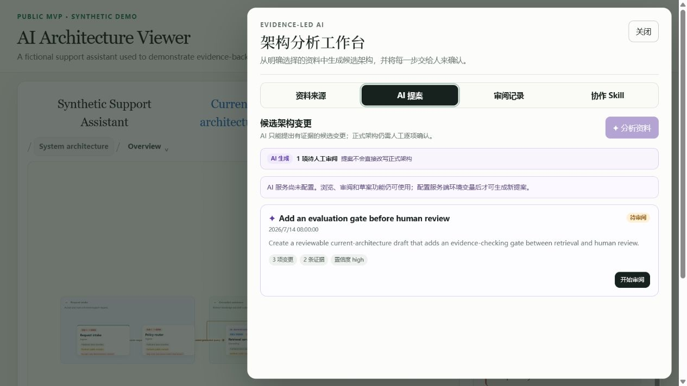
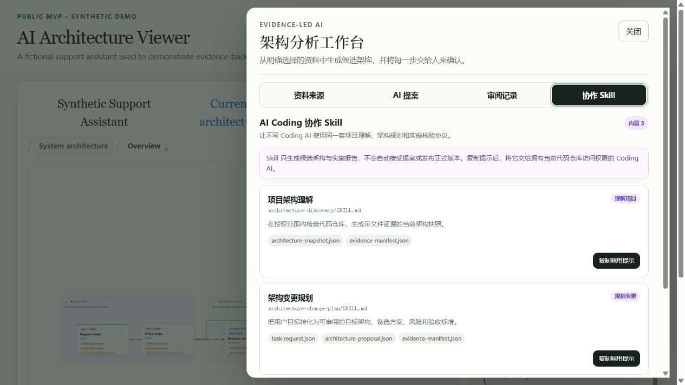

# AI 架构查看器

[English](README.en.md)

[](https://github.com/Accsy7/ai-architecture-viewer/actions/workflows/ci.yml)

[](LICENSE)

> **许可说明：** 本项目源码仅针对
> [PolyForm Noncommercial License 1.0.0](LICENSE) 定义的非商业用途开放。
> 二次开发必须保留 [NOTICE](NOTICE) 中的署名，并遵守
> [项目名称与标识使用政策](TRADEMARKS.md)。

一款基于本地优先理念的 AI 架构理解与协作工具。它将当前架构、目标意图以及用户明确选择的项目材料汇聚到同一个可视化工作区中。基于这些受控输入，AI 生成对架构的可追溯理解以及候选变更方案；用户可进行验证、修正、接受或拒绝，从而将共识转化为草稿和版本。AI 不会自动扫描整个代码仓库，且未经人工确认，不得修改已发布的架构。

## 产品预览


| 证据化 AI 提案 | AI Coding 协作技能 |
| --- | --- |
|  |  |

以上画面全部来自仓库内置的虚构 Demo，不包含客户、生产或个人数据。

### 30 秒完成一次架构理解

1. 运行 `npm start`，打开虚构 Demo 或显式指定自己的项目数据包。
2. 浏览当前架构，选择模块并核对职责、关系和控制边界。
3. 打开 **AI 分析**，只加入已获准发送的资料。
4. 对照证据审阅候选变更，逐项接受、拒绝或纠正。
5. 由人确认后写入草稿并发布；随后可在版本历史中复查或恢复。

## 使用场景

- **上手不熟悉或复杂的项目**：将现有的架构图、模块说明、技术设计或流程材料汇集到同一个视图中。AI仅根据你明确选中的材料，呈现其对职责、关系、数据流和控制边界的理解，以便你逐条纠正。
- **评审架构演进方案**：在新增模块、修改调用链或引入治理控制之前，将当前架构、目标架构及其差异并排比较。输出可作为候选草案，供讨论和反复修改。
- **将设计材料转化为可审阅的建议**：从明确选中的设计笔记、技术文档或项目材料中提取依据，生成可追溯来源的候选变更，而不是无依据地修改图表。
- **实践人机协作式架构治理**：AI负责组织架构理解，并列出带有权衡取舍的选项；由人做出决策并发布正式版本。任何变更都需人工确认，AI不得修改已发布的架构版本。
- **教学与公开演示**：使用内置的虚构示例，演示架构可视化、AI辅助理解、证据可追溯性、人工审核以及版本演进，无需携带真实业务或客户材料。

界面与项目数据隔离：查看器不包含任何特定业务的领域模型。公共仓库仅包含虚构示例。

## 快速开始

需要 [Node.js](https://nodejs.org/) 20 或更高版本。

```powershell
npm install
npm start
```

在浏览器中打开 `http://127.0.0.1:8800`。`npm start` 会先构建前端，然后启动本地API和Web服务器。

使用其他端口：

```powershell
$env:PORT = '8891'
npm start
```

若要从仓库外部加载你自己的项目数据包，请显式设置其目录：

```powershell
$env:VIEWER_PROJECT_DIR = 'D:\work\my-architecture-package'
npm start
```

## 配置模型提供商（可选）

### 数据共享边界

生成方案时，服务器会将**从你明确选中的材料中提取的证据摘要**，连同**当前架构视图中的节点、关系和字段**，发送给已配置的模型提供商。请勿选择未获准传输的材料，且绝不可将真实机密写入项目文件。

若未配置模型密钥，查看、比较、手动草稿和演示数据仍可用；仅有AI生成的方案不可用。

服务器仅从进程环境读取模型配置。`.env.example` 文档中列出了可用变量；本项目不会自动加载 `.env` 文件。请通过终端环境、部署平台的机密管理器或你自己的环境加载方式来配置实际值。

```powershell
$env:DEEPSEEK_API_KEY = 'replace-with-your-own-secret'
$env:DEEPSEEK_BASE_URL = 'https://api.deepseek.com'
$env:DEEPSEEK_MODEL = 'deepseek-v4-flash'
npm start
```

有关特定提供商的配置和模型详情，请参阅提供商的官方文档。

## 项目数据包

数据包通常包含：

- `project.json`：实例清单和默认项目标记。
- `viewer.config.json`：UI标题、视图和详情字段配置。
- `architecture-catalog.json`：架构图目录和层级导航。
- `state.json` 和 `viewer-layout.json`：已发布的语义状态和本地布局。
- `document-registry.json` 和 `documents/`：可引用的项目材料。
- `diagrams/`：其他架构图的状态和布局。
- `analysis.json`：来源、证据和AI方案的独立记录。

请将真实项目数据保留在此仓库之外，或存放在私有工作区中。

## AI编码协作技能

本仓库捆绑了三个可随项目迁移的供应商中立技能：

- `architecture-discovery`：检查授权的仓库范围，输出当前架构快照及证据清单。
- `architecture-change-plan`：将用户意图转化为备选方案、建议、目标架构变更和验收标准，但不启动实施。
- `implementation-reconcile`：将AI实际编码变更和测试结果与已批准的架构进行比对，揭示缺失、额外、变更或未验证的工作。

在 AI 分析抽屉中打开**协作技能**选项卡，可查看技能并复制交接提示。规范说明位于 [`skills/`](skills/)，供应商中立的工件协议位于 [`protocol/`](protocol/)。生成的 `ai-coding/` 输出默认不会纳入 Git 版本控制；只有在用户明确选择后，才会作为分析输入。

使用以下命令验证交换工件：

```powershell
npm run protocol:validate -- ai-coding/path/to/artifact.json
```

技能仅生成候选方案。它们不能接受自己的方案、修改已发布的架构，或代表用户批准实施。

## 开发与验证

```powershell
npm test
npm run build
```

提交变更前，至少运行：

```powershell
git status --ignored
npm test
npm run build
```

开发规范请参阅 [CONTRIBUTING.md](CONTRIBUTING.md)，安全报告请参阅 [SECURITY.md](SECURITY.md)，社区标准请参阅 [CODE_OF_CONDUCT.md](CODE_OF_CONDUCT.md)，版本变化请参阅 [CHANGELOG.md](CHANGELOG.md)。

## 公开发布边界

- 默认示例和文档必须为虚构或已获准公开发布。
- 请勿提交机密、访问令牌、内部路径、客户材料或未经脱敏的架构材料。
- AI仅可提议结构化变更；每次写入和发布均需人工确认。
- 本项目源代码采用 [PolyForm Noncommercial License 1.0.0](LICENSE) 许可。它是源代码可用（source-available）的，而非OSI定义的开源许可证。
- 该许可仅授予其定义的非商业用途下的使用、修改和分发权利。商业用途需另行书面授权；请参阅 [COMMERCIAL_LICENSE.md](COMMERCIAL_LICENSE.md)。
- 允许衍生作品，但任何公开发布修改版本者必须保留 [NOTICE](NOTICE) 中的署名，并遵守 [TRADEMARKS.md](TRADEMARKS.md)：使用不同的项目名称和 Logo，不得暗示该版本是官方版本，或由原作者维护、认可或背书。
- 第三方依赖仍受其自身许可证约束。

## 本地运行时安全边界

在 v0.1.0 中，服务仅监听 `127.0.0.1`，其变更API尚未提供身份验证、CSRF防护或远程访问控制。请勿直接将其反向代理到局域网或公共互联网。在向多人部署之前，请先添加上述保护措施。
